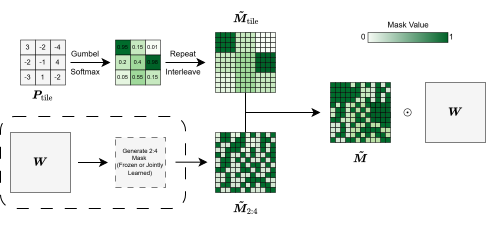

<div align="center">
  
</div>

# PATCH: Learnable Tile-level Hybrid Sparsity for LLMs

This repository hosts the official implementation and datasets for PATCH (Pruning with a Learnable Tile-level Configuration for Hybrid Sparsity), featured in our paper. PATCH optimizes large language models (LLMs) by learning a structured mask on frozen weights, assigning tiles as dense (0% sparsity) or 2:4 sparse (50% sparsity) to achieve flexible sparsity ratios up to 50%. It narrows the performance gap to dense models and delivers up to 1.37× speedup on LLaMA-2 7B.

**PATCH: Learnable Tile-level Hybrid Sparsity for LLMs**

*Younes Hourri¹, Mohammad Mozaffari¹, Maryam Mehri Dehnavi*

- *¹Equal contribution*

Paper: [https://arxiv.org/abs/2509.23410](https://arxiv.org/abs/2509.23410)

<div align="center">
  
</div>

## News

- **[Jul 2026]** 🎉 We released the **PATCH and MaskLLM mask-only checkpoints** on the HuggingFace Hub! We distribute *only the learned binary masks* (no weights) — apply them on top of the original base models to reproduce our sparse models. Browse them on the [🤗 mohammad-mozaffari](https://huggingface.co/mohammad-mozaffari) profile; per-checkpoint links (🤗) are in the [results tables](#sparse-vs-dense-performance) below.

## Setup

To clone the repository, run the following command:

```
git clone --recurse-submodules https://github.com/Paramathic/patch.git
```

The `--recurse-submodules` flag is used to clone the [SLiM repository](https://github.com/Paramathic/slim/tree/main) as a submodule. The SLiM repository is located in the `slim_local` directory.

The list of requirements can be found in the `requirements.txt` file. To install the requirements, run the following command:

```bash 
pip install -r requirements.txt
```

## Quick Start


**Adding `slim_local` to Python Path: Before running the code, `slim_local` should be added to the python path. This can be done by running the following command inside the python script:

``` python
import os
import sys

# Get the absolute path of the current script's directory
script_dir = os.path.dirname(os.path.abspath(__file__))

# Construct the path to the 'slim' directory
slim_path = os.path.join(script_dir, "slim_local")

# Add the 'slim' directory to the Python path
if slim_path not in sys.path:
    sys.path.insert(0, slim_path)
```

**Model and Tokenizer Instantiation:** Our code base supports models from HuggingFace's transformers library. In this example, we use the OPT-125M model from [facebook/opt-125m](https://huggingface.co/facebook/opt-125m).

```python
from transformers import AutoTokenizer
from slim_local.utils.model import get_llm

model_name = "facebook/opt-125m" 

model, lm_eval_model = get_llm(
    model_name=model_name,
)
model.eval()
tokenizer = AutoTokenizer.from_pretrained(
    model_name,
    use_fast=False,
)
```

The `lm_eval_model` is a wrapper around the model that provides a simple interface for evaluating the model on language modeling tasks. It is used in the evaluation scripts.

**Sparse Mask Generation**: We use the `prepare_pruned_model` function to generate the sparse mask for the model as the prior mask for PATCH. This function takes the model, the desired sparsity ratio, and the tile size as input and returns the pruned model. 

If `checkpoint_name` exists, it loads the mask from the checkpoint. Otherwise, it generates a new mask and saves it to the checkpoint.

`one_shot_args` is a dictionary that contains the arguments for the one-shot pruning method. In this example, we use the Wanda method with 2:4 sparsity pattern and 50% sparsity ratio. More details about the arguments can be found in the *Function Documentation* section.


```python
from patch.utils import prepare_pruned_model

one_shot_args = {
    "prune_method": "wanda",
    "sparsity_type": "2:4",
    "sparsity_ratio": 0.5,
    "nsamples": 128,
    "maskllm_checkpoint": None,
    "optimizer_FT_pruning": "adamw_torch",
    "calibration_dataset": "c4",
    "eval_dataset": "wikitext2",
    "shift_zero_metrics": False,
    "fine_tune": False,
}

target_sparsity_ratio = 0.45
mask_tile_size = (128, 128)


compressed_model = prepare_pruned_model(
    model,
    tokenizer,
    checkpoint_name,
    prune_args=one_shot_args,
    mask_tile_size=mask_tile_size,
    target_sparsity_ratio=target_sparsity_ratio,
)
```

**PATCH Training:** After generating the sparse mask, the model is ready for training with PATCH. `mask_args` is a dictionary that contains the arguments for the PATCH training. In this example, we use a tile size of (128, 128) and a target sparsity ratio of 45%. More details about the arguments can be found in the *Function Documentation* section.


```python
from patch.fine_tune_mask import learn_mask

learnable_args = {
    "learnable_mask": True,
    "mask_tile_size": mask_tile_size,
    "grad_checkpoint": True,
    "local_bs": 1,
    "optimizer": "adamw_torch",
    "fine_tuning_sequence_length": 4096,
    "target_sparsity_ratio": target_sparsity_ratio,
    "lr": 1e-3,
    "sparse_reg": 7,
    "weight_reg": 10.0,
    "temp_schedule_2_4": [4.0, 0.05],
    "scaler_schedule_2_4": [100.0, 500.0],
    "hard_2_4": False,
    "prior_strength_2_4": 3.0,
    "joint_optim": True,
    "temp_schedule_tile": [4.0, 0.05],
    "scaler_schedule_tile": [25.0, 350.0],
    "hard_tile": False,
    "prior_strength_tile": 3.0,
    "mask_llm": False,
    "layer_target": False,
}

model, lm_eval_model = learn_mask(
    model_name=model_name,
    compressed_model=compressed_model,
    tokenizer=tokenizer,
    mask_args=learnable_args,
)
```

**Evaluation:** After training, the model can be evaluated using the `evaluate` function. This function takes the model, tokenizer, and evaluation arguments as input and returns the evaluation results.

```python
from patch.utils import evaluate

ppl_test, lmharness_results = evaluate(
    model,
    lm_eval_model,
    tokenizer,
    evaluate_perplexity=True,
    eval_dataset="wikitext2",
    eval_batch_size=1,
    test_lmharness=True,
)
```

For a more automated script to run PATCH on SLURM clusters, please refer to the `scripts/submit_jobs.sh` script.

## Experimental Results

We evaluate PATCH on a range of transformer models from 0.5B to 8B parameters, including Qwen-2.5, LLaMA-2, LLaMA-3, and Gemma-3 families. Models are trained on the SlimPajama dataset for 2000 steps with batch size 256 and sequence length 4096. Evaluation includes average accuracy across eight zero-shot tasks (PIQA, ARC-Easy, ARC-Challenge, Winogrande, OpenBookQA, RACE, HellaSwag, MMLU) and perplexity (PPL) on WikiText2.

### Joint Sparse and Dense Tile Optimization (Smaller Models)

For models like Qwen-2.5 0.5B, LLaMA-3.2 1B, and Gemma-3 1B, we use PATCH<sup>Joint</sup>  to optimize dense tile locations and sparsity patterns within sparse tiles.

# Sparse vs Dense Performance

🤗 = mask-only checkpoint released on the HuggingFace Hub (click to open the model card).

| Sparsity | Method      | Pattern            | Qwen-2.5 0.5B<br>Acc (% ↑) | Qwen-2.5 0.5B<br>PPL (↓) | LLaMA-3.2 1B<br>Acc (% ↑) | LLaMA-3.2 1B<br>PPL (↓) | Gemma-3 1B<br>Acc (% ↑) | Gemma-3 1B<br>PPL (↓) |
|----------|-------------|--------------------|---------------------------|--------------------------|---------------------------|--------------------------|--------------------------|--------------------------|
| 0%       | Dense       | -                  | 46.00                     | 12.08                   | 47.70                     | 9.06                    | 47.01                    | 11.67                   |
| 50%      | Magnitude   | 2:4                | 30.16                     | 6734.97                 | 29.66                     | 563.44                  | 31.66                    | 5005.56                 |
|          | Wanda       | 2:4                | 32.97                     | 72.48                   | 31.61                     | 78.18                   | 34.16                    | 69.41                   |
|          | SparseGPT   | 2:4                | 34.81                     | 36.59                   | 35.55                     | 32.73                   | 35.58                    | 44.59                   |
|          | Thanos      | 2:4                | 31.31                     | 37.32                   | 35.71                     | 33.03                   | 35.09                    | 62.63                   |
|          | ProxSparse  | 2:4                | 32.05                     | 111.05                  | 33.55                     | 49.33                   | 36.63                    | 90.50                   |
|          | MaskLLM     | 2:4                | 39.33                     | 15.22                   | 41.04 [🤗](https://huggingface.co/mohammad-mozaffari/llama_3.2_1b-MaskLLM-50Sparse) | 12.93                   | 41.84 [🤗](https://huggingface.co/mohammad-mozaffari/gemma_3_1b-MaskLLM-50Sparse) | 12.82                   |
| 45%      | PATCH<sup>Joint</sup>   | Dense/2:4 Tiles    | 40.29 [🤗](https://huggingface.co/mohammad-mozaffari/qwen2.5_0.5b-PATCH-45Sparse) | 14.57                   | 42.08 [🤗](https://huggingface.co/mohammad-mozaffari/llama_3.2_1b-PATCH-45Sparse) | 12.23                   | 42.80 [🤗](https://huggingface.co/mohammad-mozaffari/gemma_3_1b-PATCH-45Sparse) | 11.96                   |
| 35%      | PATCH<sup>Joint</sup>   | Dense/2:4 Tiles    | 41.15 [🤗](https://huggingface.co/mohammad-mozaffari/qwen2.5_0.5b-PATCH-35Sparse) | 13.84                   | 42.72 [🤗](https://huggingface.co/mohammad-mozaffari/llama_3.2_1b-PATCH-35Sparse) | 11.67                   | 43.30 [🤗](https://huggingface.co/mohammad-mozaffari/gemma_3_1b-PATCH-35Sparse) | 11.48                   |
| 25%      | PATCH<sup>Joint</sup>   | Dense/2:4 Tiles    | 42.39 [🤗](https://huggingface.co/mohammad-mozaffari/qwen2.5_0.5b-PATCH-25Sparse) | 13.47                   | 43.81 [🤗](https://huggingface.co/mohammad-mozaffari/llama_3.2_1b-PATCH-25Sparse) | 11.00                   | 44.07 [🤗](https://huggingface.co/mohammad-mozaffari/gemma_3_1b-PATCH-25Sparse) | 11.17                   |


PATCH<sup>Joint</sup>  provides a flexible sparsity-accuracy tradeoff, narrowing the gap to dense performance while maintaining hardware-friendly patterns.


Memory-Efficient Tile Selection (Larger Models)
For LLaMA-2 7B, LLaMA-2 13B, and LLaMA-3.1 8B, we use PATCH<sup>Tile</sup> , freezing sparse patterns and optimizing only dense tile selections for reduced memory overhead.

# Sparse vs Dense Performance (LLaMA Models)

| Sparsity | Method     | Pattern          | LLaMA-2 7B<br>Acc (% ↑) | LLaMA-2 7B<br>PPL (↓) | LLaMA-2 13B<br>Acc (% ↑) | LLaMA-2 13B<br>PPL (↓) | LLaMA-3.1 8B<br>Acc (% ↑) | LLaMA-3.1 8B<br>PPL (↓) |
|----------|------------|------------------|-------------------------|-----------------------|--------------------------|-------------------------|---------------------------|--------------------------|
| 0%       | Dense      | -                | 54.61                   | 5.12                  | 58.38                    | 4.89                    | 60.31                     | 5.84                     |
| 50%      | Magnitude  | 2:4              | 43.44                   | 54.39                 | 45.94                    | 8.89                    | 35.93                     | 765.92                   |
|          | Wanda      | 2:4              | 44.30                   | 11.15                 | 47.95                    | 8.91                    | 41.77                     | 21.29                    |
|          | SparseGPT  | 2:4              | 45.09                   | 10.12                 | 49.67                    | 8.86                    | 45.53                     | 15.11                    |
|          | Thanos     | 2:4              | 44.80                   | 11.19                 | 49.33                    | 8.80                    | 45.72                     | 16.09                    |
|          | ProxSparse | 2:4              | 45.92                   | 9.18                  | 50.80                    | 7.11                    | 45.14                     | 15.17                    |
|          | MaskLLM    | 2:4              | 48.62                   | 6.78                  | N/A                      | N/A                     | 52.80                     | 8.58                     |
| 45%      | PATCH<sup>Tile</sup>   | Dense/2:4 Tiles  | 48.99 [🤗](https://huggingface.co/mohammad-mozaffari/llama_2_7b-PATCH-45Sparse) | 6.55                  | 53.24 [🤗](https://huggingface.co/mohammad-mozaffari/llama_2_13b-PATCH-45Sparse) | 5.85                    | 53.60 [🤗](https://huggingface.co/mohammad-mozaffari/llama_3.1_8b-PATCH-45Sparse) | 8.20                     |
| 35%      | PATCH<sup>Tile</sup>   | Dense/2:4 Tiles  | 50.08 [🤗](https://huggingface.co/mohammad-mozaffari/llama_2_7b-PATCH-35Sparse) | 6.18                  | 54.60 [🤗](https://huggingface.co/mohammad-mozaffari/llama_2_13b-PATCH-35Sparse) | 5.44                    | 55.28 [🤗](https://huggingface.co/mohammad-mozaffari/llama_3.1_8b-PATCH-35Sparse) | 7.89                     |
| 25%      | PATCH<sup>Tile</sup>   | Dense/2:4 Tiles  | 51.58 [🤗](https://huggingface.co/mohammad-mozaffari/llama_2_7b-PATCH-25Sparse) | 5.86                  | 56.31 [🤗](https://huggingface.co/mohammad-mozaffari/llama_2_13b-PATCH-25Sparse) | 5.00                    | 56.48 [🤗](https://huggingface.co/mohammad-mozaffari/llama_3.1_8b-PATCH-25Sparse) | 7.34                     |


## Released Checkpoints (Masks)

We release the learned **masks only** (no base-model weights) for both PATCH and
the MaskLLM baselines on the [🤗 mohammad-mozaffari](https://huggingface.co/mohammad-mozaffari)
Hub. Repositories are named `MODEL-METHOD-SPARSITYSparse`
(e.g. `gemma_3_1b-PATCH-45Sparse`, `llama_3.2_1b-MaskLLM-50Sparse`). Since PATCH
keeps the base weights frozen, applying a released mask on top of the original
base model exactly reproduces our sparse model.

Available checkpoints:
- **PATCH** (25% / 35% / 45% sparsity, mask only): `qwen2.5_0.5b`, `llama_3.2_1b`, `gemma_3_1b`, `llama_2_7b`, `llama_2_13b`, `llama_3.1_8b`
- **MaskLLM** (50% 2:4 baseline): `gemma_3_1b`, `llama_3.2_1b`, `llama_3.2_3b`

```python
from huggingface_hub import hf_hub_download
from transformers import AutoModelForCausalLM
import torch
from scripts.release.load_patch_mask import apply_patch_mask

npz = hf_hub_download(repo_id="mohammad-mozaffari/gemma_3_1b-PATCH-45Sparse", filename="mask.npz")
model = AutoModelForCausalLM.from_pretrained("google/gemma-3-1b-pt", torch_dtype=torch.bfloat16)
apply_patch_mask(model, npz)  # zeroes the pruned weights in place
```

The masks are packaged and uploaded with [`scripts/release/build_release.py`](scripts/release/build_release.py):

```bash
# Preview one repo locally (writes README + mask.npz, no upload):
python scripts/release/build_release.py --only gemma_3_1b-PATCH-45Sparse

# Publish everything to the Hub:
HF_TOKEN=hf_xxx python scripts/release/build_release.py --push
```

Each mask is distributed under its **base model's license** (Apache-2.0 for
Qwen-2.5; the Llama 2 / 3.1 / 3.2 Community Licenses for the LLaMA models; the
Gemma Terms of Use for Gemma-3). You must obtain the base model separately and
comply with its license. The mask-generation code is MIT-licensed.

## Function Documentation

### patch.utils.prepare_pruned_model
- `model`: The model to be pruned/compressed.
- `tokenizer`: The tokenizer associated with the model.
- `checkpoint_name`: Path to save/load the pruned model checkpoint.
- `mask_tile_size`: Tile size for mask parameters as (row_tile_size, col_tile_size).
- `target_sparsity_ratio`: Target sparsity ratio for the unstructured reference model.
- `seed`: Random seed for reproducibility.
- `prune_args`: Arguments for pruning and quantization in dictionary or arguments format. The dictionary should contain the following keys:
  - `prune_method`: Pruning method to use. Options: `magnitude`, `wanda`, `sparsegpt`, `thanos`, `prox_sparse`.
  - `sparsity_type`: Sparsity pattern to use. Options: `unstructured`, `2:4`.
  - `sparsity_ratio`: Sparsity ratio to achieve (0 < ratio < 1).
  - `nsamples`: Number of samples for data-dependent methods (e.g., Wanda, SparseGPT).
  - `maskllm_checkpoint`: Path to MaskLLM checkpoint if using MaskLLM.
  - `optimizer_FT_pruning`: Optimizer for fine-tuning during pruning. Options: `adamw_torch`, `adamw_apex`.
  - `calibration_dataset`: Dataset for calibration. Options: `c4`, `wikitext2`.
  - `eval_dataset`: Dataset for evaluation. Options: `wikitext2`, `ptb`.
  - `shift_zero_metrics`: Whether to shift zero metrics.
  - `fine_tune`: Whether to fine-tune the model after pruning.

### patch.fine_tune_mask.learn_mask
- `model_name`: Name of the model to be fine-tuned.
- `local_files_only`: Whether to load the model from local files only.
- `compressed_model`: The pruned/compressed model to be fine-tuned.
- `tokenizer`: The tokenizer associated with the model.
- `local_files_only`: Whether to load the model from local files only.
- `hf_token`: HuggingFace token for private models (default: None).
- `wandb`: Whether to log training with Weights & Biases.
- `mask_args`: Arguments for mask learning in dictionary or arguments format. The dictionary should contain the following keys:
  - `learnable_mask`: Whether to learn the mask.
  - `mask_tile_size`: Tile size for mask parameters as (row_tile_size, col_tile_size).
  - `grad_checkpoint`: Whether to use gradient checkpointing.
  - `local_bs`: Local batch size for training.
  - `optimizer`: Optimizer for training. Options: `adamw_torch`, `adamw_apex`.
  - `fine_tuning_sequence_length`: Sequence length for fine-tuning  steps.
  - `target_sparsity_ratio`: Target sparsity ratio for the learned mask.
  - `lr`: Learning rate for training.
  - `sparse_reg`: Regularization strength for sparsity.
  - `weight_reg`: Regularization strength for weight decay.
  - `temp_schedule_2_4`: Temperature schedule for 2:4 sparsity pattern as [start_temp, end_temp].
  - `scaler_schedule_2_4`: Scaling schedule for 2:4 sparsity pattern as [start_step, end_step].
  - `hard_2_4`: Whether to use hard 2:4 sparsity during training.
  - `prior_strength_2_4`: Prior strength for 2:4 tile logits.
  - `temp_schedule_tile`: Temperature schedule for tile selection as [start_temp, end_temp].
  - `scaler_schedule_tile`: Scaling schedule for tile selection as [start_step, end_step].
  - `hard_tile`: Whether to use hard tile selection during training.
  - `prior_strength_tile`: Prior strength for tile logits.
  - `mask_llm`: Whether to train with MaskLLM (2:4 mask only).
  - `layer_target`: Whether to apply target sparsity per layer.


## Speedup Experiments

We will provide the scipt for integrating [STOICC](https://github.com/Paramathic/stoicc) with PATCH for speedup experiments soon.

## Acknowledgement
This repository is build upon the [SLiM](https://github.com/Paramathic/slim) repository.

## Citation
If you use PATCH in your research, please cite our paper:
```angular2html
@article{hourri2025patch,
    title        = {{PATCH: One-shot Quantized Sparse Plus Low-rank Approximation of LLMs}},
    author       = {Hourri, Younes and Mozaffari, Mohammad and Mehri Dehnavi, Maryam},
    year         = 2025,
}
```
